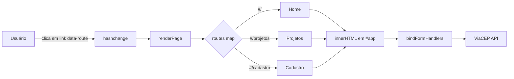
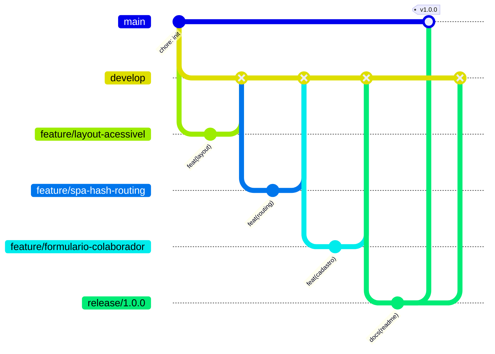

# ONG Bem-Te-Vi — Site Institucional

Site institucional da **ONG Bem-Te-Vi**, organização dedicada à promoção da
inclusão e da acessibilidade para pessoas com deficiência. A plataforma
apresenta as iniciativas sociais da organização e permite o cadastro de novos
voluntários e colaboradores.

> *Transformando vidas por meio de educação, solidariedade e cidadania.*

---

## 1. Sumário

1. [Sumário](#1-sumário)
2. [Visão Geral](#2-visão-geral)
3. [Funcionalidades](#3-funcionalidades)
4. [Stack Tecnológica](#4-stack-tecnológica)
5. [Arquitetura](#5-arquitetura)
6. [Acessibilidade Implementada](#6-acessibilidade-implementada)
7. [Estrutura de Pastas](#7-estrutura-de-pastas)
8. [Instalação e Execução](#8-instalação-e-execução)
9. [Integrações Externas](#9-integrações-externas)
10. [Estratégia de Versionamento (GitFlow)](#10-estratégia-de-versionamento-gitflow)
11. [Convenção de Commits](#11-convenção-de-commits)
12. [Histórico de Versões](#12-histórico-de-versões)
13. [Modelo de Dados Prospectivo](#13-modelo-de-dados-prospectivo)
14. [Como Contribuir](#14-como-contribuir)
15. [Autoria](#15-autoria)

---

## 2. Visão Geral

O projeto consiste em uma aplicação web estática de página única (**SPA**) que
centraliza a comunicação institucional da ONG. O sistema contempla três rotas
principais:

| Rota | Conteúdo |
|------|----------|
| `#/` | Página inicial: apresentação, missão, indicadores de impacto e destaques |
| `#/projetos` | Catálogo completo das iniciativas sociais em andamento |
| `#/cadastro` | Formulário de captação de voluntários e colaboradores |

As iniciativas divulgadas abrangem tecnologia assistiva (FabLab com impressão
3D para adaptações personalizadas), formação jurídica (Academia de Ativismo),
acessibilidade comunicacional (Libras, Braille e audiodescrição), apoio
jurídico e empreendedorismo inclusivo.

### Indicadores de impacto apresentados

| Métrica | Valor |
|---------|-------|
| Pessoas atendidas | 1.200+ |
| Voluntários ativos | 28 |
| Projetos apoiados | 45 |
| Taxa de satisfação | 96% |

---

## 3. Funcionalidades

### Roteamento por hash
Implementação de navegação SPA sem recarregamento de página. Cada rota é
resolvida por um mapa de funções que injeta o conteúdo dinamicamente no
elemento `#app`.

### Máscaras de entrada em tempo real
Formatação automática aplicada durante a digitação (`input` event):

- **CPF:** `000.000.000-00` (limite de 11 dígitos)
- **Telefone/WhatsApp:** `(00) 00000-0000`, com variante para fixo
- **CEP:** `00000-000`

### Validação de formulário
Combina validação nativa do HTML5 (`checkValidity()`, `reportValidity()`) com
feedback visual em dois canais simultâneos: alerta contextual junto ao formulário
e notificação *toast* temporária.

### Consulta de CEP
Ao completar 8 dígitos, o sistema consulta automaticamente a API ViaCEP e
informa o resultado ao usuário.

### Sistema de notificações (toasts)
Componente imperativo com quatro variantes (`success`, `warning`, `danger`,
`info`), autoencerramento após 4,2 segundos e fechamento manual.

### Menu responsivo acessível
Controle do menu hambúrguer com gestão de `aria-expanded`, bloqueio de rolagem
do corpo quando aberto e fechamento automático ao clicar fora da área de navegação.

---

## 4. Stack Tecnológica

| Camada | Tecnologia | Observação |
|--------|------------|------------|
| Marcação | HTML5 | Semântico e orientado a WAI-ARIA |
| Estilização | CSS3 | BEM, Flexbox e Grid |
| Lógica | JavaScript ES6+ | Vanilla, sem dependências |
| Build | Nenhum | Dispensa compiladores e bundlers |
| Controle de versão | Git + GitHub | Estratégia GitFlow |

A ausência de frameworks é intencional: reduz superfície de ataque, elimina
dependências obsoletas e garante compatibilidade prolongada, fator relevante
para organizações do terceiro setor com infraestrutura limitada.

---

## 5. Arquitetura

O padrão adotado é **roteamento client-side por hash**, escolhido por operar
sem configuração de servidor — qualquer hospedagem estática resolve a rota
`index.html` e o fragmento `#/rota` é tratado integralmente pelo navegador.



### Fluxo de renderização

1. O clique é interceptado por delegação de eventos em `document.body`
2. A alteração do hash dispara o listener `hashchange`
3. `renderPage()` normaliza a rota e resolve a função correspondente
4. O HTML retornado é injetado em `#app`
5. `updateNavigation()` sincroniza `aria-current` nos links ativos
6. `bindFormHandlers()` vincula máscaras e validação apenas se os campos existirem

A verificação de existência antes de cada vínculo evita erros ao trocar entre
rotas que possuem ou não formulário — condição necessária porque `innerHTML`
descarta os nós anteriores.

---

## 6. Acessibilidade Implementada

Tratando-se de uma organização que atende pessoas com deficiência, a
acessibilidade não é requisito secundário, e sim premissa estrutural do código.

| Recurso | Implementação | Benefício |
|---------|---------------|-----------|
| Regiões landmark | `<header>`, `<nav>`, `<main>`, `<footer>` | Navegação por leitor de tela |
| Rótulos de contexto | `aria-label` em logo, menu e rodapé | Identificação de seções |
| Página atual | `aria-current="page"` dinâmico na rota ativa | Orientação espacial |
| Estados expandidos | `aria-expanded` no menu hambúrguer | Informe estado ao AT |
| Regiões vivas | `aria-live="polite"` / `assertive` | Anúncio de toasts e alertas |
| Semântica atômica | `aria-atomic` no contêiner de toasts | Leitura completa da mensagem |
| Papéis dinâmicos | `role="alert"` alternando conforme criticidade | Prioridade correta |
| Agrupamento | `<fieldset>` + `<legend>` no formulário | Contexto dos grupos de campos |
| Relação rótulo-campo | `for`/`id` em todas as entradas | Foco acionável por voz |

---

## 7. Estrutura de Pastas

```text
ong_bem-te_vi_site/
├── index.html                  # Shell da aplicação e pontos de montagem
├── Cadastro.html               # Versão legada (fallback sem JavaScript)
├── Projetos.html               # Versão legada (fallback sem JavaScript)
├── README.md
└── assets/
    ├── Imgs/
    │   ├── logo bemtevi.svg
    │   └── painel.jpg
    ├── JS/
    │   └── main.js             # Roteador, máscaras, validação e toasts
    └── Style.css/
        └── style.css
```

> **Nota sobre as páginas legadas:** `Cadastro.html` e `Projetos.html` foram
> mantidas deliberadamente como degradação graciosa. Caso o JavaScript esteja
> indisponível, a navegação por links clássicos continua funcional. Essa decisão
> será revisada em release futura mediante análise de custo de manutenção.

---

## 8. Instalação e Execução

Por se tratar de aplicação estática, não há etapa de compilação.

### Pré-requisitos

- Navegador moderno com suporte a ES6 (Chrome 90+, Firefox 88+, Edge 90+)
- Git 2.30 ou superior (apenas para contribuição)

### Passos

```bash
# 1. Clonar o repositório
git clone https://github.com/DanFarias90s/ong_bem-te_vi_site.git

# 2. Entrar no diretório
cd ong_bem-te_vi_site

# 3. Abrir diretamente no navegador
start index.html
```

### Servidor local (recomendado)

Alguns navegadores restringem requisições `fetch` em protocolo `file://`. Para
testar a consulta de CEP com fidelidade, utilize um servidor local:

```bash
# Com Python instalado
python -m http.server 8080
```

Acesse então `http://localhost:8080`.

---

## 9. Integrações Externas

| Serviço | Endpoint | Finalidade | Tratamento de falha |
|---------|----------|------------|---------------------|
| ViaCEP | `https://viacep.com.br/ws/{cep}/json/` | Validação de CEP | Toast de erro em caso de indisponibilidade de rede |

A integração é resiliente: campo incompleto não gera requisição, CEP inexistente
retorna aviso amigável e queda de conexão não interrompe o preenchimento do
formulário.

---

## 10. Estratégia de Versionamento (GitFlow)

O projeto adota o padrão **GitFlow**, que segrega o código conforme seu nível de
maturidade. Embora o desenvolvimento tenha sido individual, a estrutura foi
replicada fielmente para refletir o fluxo colaborativo de uma equipe de engenharia.



### Branches permanentes

- **`main`** — espelho do ambiente de produção. Recebe código exclusivamente via
  merges de `release/*` e `hotfix/*`, sempre acompanhado de tag semântica
  anotada (`v1.0.0`).
- **`develop`** — linha de integração contínua. Concentra as funcionalidades já
  concluídas, representando o próximo lançamento em formação.

### Branches temporárias

- **`feature/<nome>`** — cada funcionalidade nasceu do `develop` e a ele retornou
  por merge com `--no-ff`. O isolamento garantiu que trabalho incompleto jamais
  contaminasse a base de integração:

  | Branch | Escopo |
  |--------|--------|
  | `feature/layout-acessivel` | Header, footer, grid de projetos e folha de estilo |
  | `feature/spa-hash-routing` | Roteador por hash e `aria-current` dinâmico |
  | `feature/formulario-colaborador` | Val
